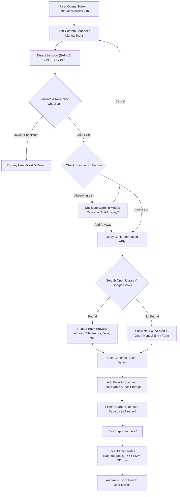

# Book Barcode Scanner and Excel Export System

A responsive web application designed for libraries, bookstores, schools, and personal collections to scan book barcodes, retrieve rich bibliographic information, manage a digital inventory, and export the collection into Microsoft Excel (`.xlsx`) spreadsheets.

---

## System Architecture & Workflow



---

## Core Features

### 1. Barcode Scanning
* **Camera Scanning:** Live camera feed with reticle overlay, corner targeting guides, and animated laser scanning beam.
* **Supported Formats:** EAN-13, ISBN-13, and ISBN-10 barcodes.
* **Device Control:** Switch between front and rear cameras, toggle flashlight/torch on mobile devices.
* **Audio & Haptic Feedback:** Synthesized Web Audio beep (880 Hz $\to$ 1760 Hz) and vibration cue on successful decode.
* **Image File Scanning:** Upload a photo of a barcode from your device if a live webcam is unavailable.
* **Debounce & Duplicate Protection:** 2.5-second scan cooldown plus automatic comparison against existing records with a confirmation warning modal.

### 2. ISBN Validation & Normalization
* **ISBN-10:** Strict modulo-11 checksum validation with support for check digit `'X'`.
* **ISBN-13 / EAN-13:** Modulo-10 alternating weight ($1 \times, 3 \times$) checksum validation.
* **Automatic Conversion:** Converts valid ISBN-10 numbers to standard 13-digit ISBN format (`978...`).
* **Input Sanitization:** Strips hyphens, spaces, and formatting characters automatically.

### 3. Bibliographic Data Retrieval
* **Universal Multi-Tier Search Engine:**
  1. **Tier 1:** Local Server Online Web Lookup Proxy (`/api/lookup?isbn=...`) with real-time web catalog search (Amazon, DirectTextbook, academic retailers).
  2. **Tier 2:** Open Library Search API (`https://openlibrary.org/search.json?isbn=...`).
  3. **Tier 3:** Open Library Direct ISBN API (`https://openlibrary.org/isbn/...json`).
  4. **Tier 4:** Google Books Volume API (`https://www.googleapis.com/books/v1/volumes?q=isbn:...`).
  5. **Tier 5:** Extended Global & Regional Catalog for uncataloged academic and international publications (e.g. Discovery Publishing House, India - `9788171419128`).
* **Retrieved Metadata:** Title, Author(s), Publisher, Publication Date, Cover Image URL, Category/Subjects, and Description.
* **Zero Fabrication Policy:** If any metadata field is unavailable in public databases, it is clearly displayed as *"Not available"* rather than fabricated.

### 4. Interactive Scanned Books Table
* **Table Columns:** `S/N`, `ISBN`, `Title`, `Author`, `Publisher`, `Publication Date`, `Actions`.
* **Search / Filter:** Real-time search filter across Title, Author, Publisher, and ISBN.
* **Record Management:** View full details modal, inline edit details, or remove individual records.
* **Persistence:** Synchronizes automatically with browser `localStorage`.
* **Session Controls:** "Clear All" with confirmation safeguard.

### 5. Excel & CSV Export
* **Spreadsheet Format:** Generates valid `.xlsx` files using SheetJS.
* **Dynamic Naming:** Follows standard ISO date stamping: `scanned_books_YYYY-MM-DD.xlsx` (e.g. `scanned_books_2026-09-25.xlsx`).
* **Text Formatting:** Preserves ISBN numbers as text strings (`t: 's'`) so Excel will never corrupt them into scientific notation (e.g. `9.78E+12`).
* **Auto Column Widths:** Intelligently sizes each column according to content length.

---

## File Structure

```
c:\Users\KIU\Desktop\Library Books\
├── index.html                   # Main application web interface
├── test-barcodes.html           # Interactive barcode test sheet (printable & scannable)
├── start-server.ps1             # Lightweight PowerShell localhost HTTP server
├── start-server.bat             # 1-Click Windows batch launcher
├── verify-system.ps1            # Automated unit test suite (19 test assertions)
├── TESTING_REPORT.md            # Comprehensive test execution report for all 9 scenarios
├── README.md                    # Project documentation & user guide
└── assets/
    ├── css/
    │   └── styles.css           # Modern responsive design & layout stylesheet
    └── js/
        ├── zxing.min.js         # ZXing barcode scanner library (offline bundled)
        ├── xlsx.full.min.js     # SheetJS Excel exporter library (offline bundled)
        ├── jsbarcode.min.js     # Barcode generator library for testing sheet
        ├── isbn-validator.js    # ISBN-10 / 13 checksum & conversion module
        ├── api-service.js       # Book bibliographic retrieval service
        ├── excel-export.js      # Excel and CSV export generation module
        ├── scanner.js           # Camera, torch, audio, and decode controller
        └── app.js               # Application state, UI events, and table rendering
```

---

## Quick Start: How to Run

### Method 1: 1-Click Windows Launcher (Recommended)
1. Double-click **`start-server.bat`** in Windows Explorer.
2. The script will start a local server at `http://localhost:8080` and automatically open your default browser.
3. *Why localhost?* Modern web browsers require a secure context (`https://` or `http://localhost`) to grant webcam access (`getUserMedia`).

### Method 2: PowerShell Console
Open PowerShell in the project directory and run:
```powershell
powershell -NoProfile -ExecutionPolicy Bypass -File .\start-server.ps1
```

### Method 3: Direct File Execution
You can also open `index.html` directly in any web browser. In direct file mode, Manual ISBN Lookup, Image File Barcode Scanning, Table Management, and Excel Export function fully. (For live webcam scanning, modern browsers require `http://localhost:8080` via Method 1 or 2).

---

## Testing the System

Open **`test-barcodes.html`** in your browser or print it out. It generates scannable barcodes for all 9 assignment test cases:
1. **Valid ISBN-13:** `9780132350884` (*Clean Code*)
2. **Valid ISBN-10:** `020161622X` (*The Pragmatic Programmer*)
3. **Incomplete Information:** `9781440058295` (*Calculus Made Easy* - sparse metadata)
4. **Invalid ISBN Checksum:** `9780132350880` (Corrupted check digit rejected)
5. **ISBN Not Found in Database:** `9789999999993` (Prompts manual entry)
6. **Duplicate Book Scan:** `9780596517748` (*JavaScript: The Good Parts* - triggers warning)
7. **Manual ISBN Entry:** Type any ISBN or click the quick test chips in `index.html`
8. **Camera Permission Denied:** Simulated and caught with friendly UI guidance
9. **Multi-Book Excel Export:** Click *"Load 5 Sample Books"* then *"Export to Excel"* to test instant spreadsheet generation.

To run the automated verification script in PowerShell:
```powershell
powershell -NoProfile -ExecutionPolicy Bypass -File .\verify-system.ps1
```

---

## Browser Support
* Microsoft Edge (Chromium)
* Google Chrome
* Mozilla Firefox
* Apple Safari (iOS / macOS)
* Mobile Chrome / Mobile Safari (Android & iPhone)

---

## License
Open source for educational, personal, and commercial library cataloging use.
